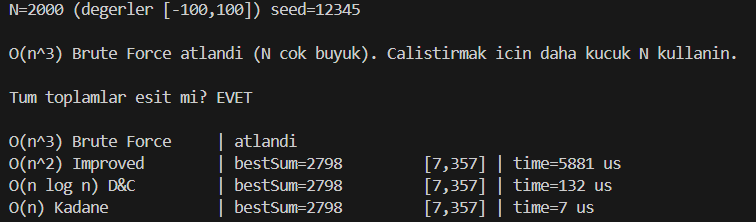
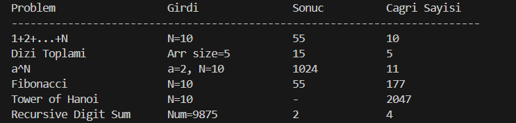
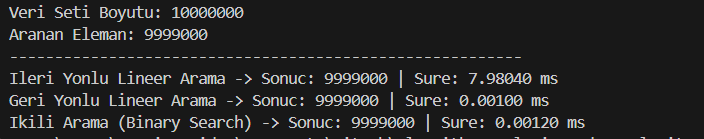
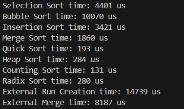
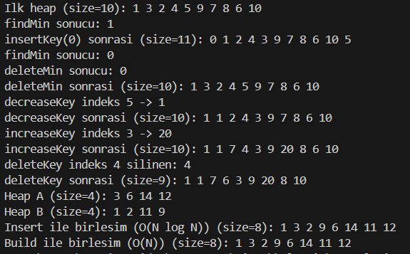
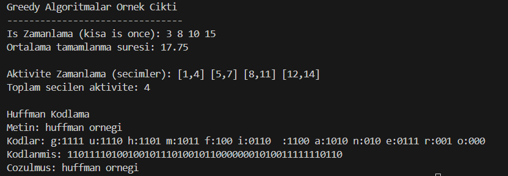
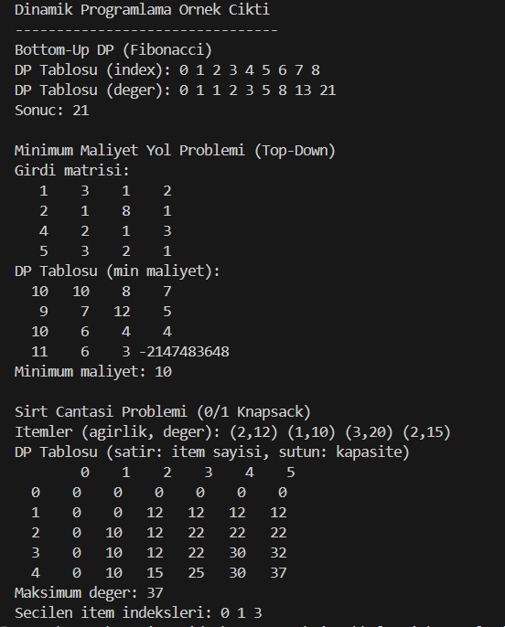

# algorithm-analysis-and-complexity

Bu repo, Algoritma Analizi ve Karmasikligi dersi kapsamindaki ornek algoritmalari C++ ile uygular ve performans/karmasiklik karsilastirmalarini gosterir. Her dosya tek bir konuya odaklanir; ciktilar ise terminalde calistirilabilir, okunabilir raporlar verecek sekilde duzenlenmistir.

## Proje Amaci
- Farkli algoritma yaklasimlarini ayni problem uzerinde karsilastirmak.
- Zaman karmasikligi ve pratik calisma surelerini gozlemek.
- Ciktiyi okunabilir hale getirmek (tablo, adim adim aciklama, vb.).

## Dosyalar ve Rapor

### `maximum_subsequence.cpp`
**Konu:** Maximum Subsequence (maksimum alt dizi toplami)

**Yaklasimlar:**
- O(n^3) brute force: Tum alt dizileri uc katmanli dongu ile dener.
- O(n^2) gelistirilmis brute force: Toplami akumule ederek tekrar hesaplamayi azaltir.
- O(n log n) divide and conquer: Sol/sag/cross alt dizi karsilastirir.
- O(n) Kadane: Tek geciste en iyi alt diziyi bulur.

**Calisma mantigi:**
- Ayni rastgele veri uzerinde tum yaklasimlar calistirilir.
- Sonuclarin ayni olup olmadigi kontrol edilir.
- Her yontem icin sure (microsecond) raporlanir.

**Zaman Karmasikligi Tablosu:**

| Yaklasim | Zaman | Ek Bellek |
| --- | --- | --- |
| O(n^3) Brute Force | O(n^3) | O(1) |
| O(n^2) Improved | O(n^2) | O(1) |
| Divide and Conquer | O(n log n) | O(log n) |
| Kadane | O(n) | O(1) |

**Terminal Cikti Gorseli (placeholder):**


---

### `recursive_algorithms.cpp`
**Konu:** Temel rekursif problemler ve cagri sayisi analizi

**Problemler:**
- 1+2+...+N
- Dizi toplami
- a^n
- Fibonacci (naif rekursif)
- Tower of Hanoi (cagri sayisi)
- Recursive Digit Sum

**Calisma mantigi:**
- Her fonksiyon icin cagri sayisi sayacla takip edilir.
- Cikti tablosunda girdi, sonuc ve cagri sayisi yan yana verilir.

**Zaman Karmasikligi Tablosu (ana yaklasimlar):**

| Problem | Zaman | Ek Bellek |
| --- | --- | --- |
| 1+2+...+N | O(n) | O(n) |
| Dizi toplami | O(n) | O(n) |
| a^n (naif) | O(n) | O(n) |
| Fibonacci (naif) | O(2^n) | O(n) |
| Tower of Hanoi | O(2^n) | O(n) |
| Recursive Digit Sum | O(k) | O(k) |

Not: k = basamak sayisi.

**Terminal Cikti Gorseli (placeholder):**


---

### `search_algorithms.cpp`
**Konu:** Arama algoritmalari ve sure karsilastirmasi

**Yaklasimlar:**
- Ileri yonlu lineer arama
- Geri yonlu lineer arama
- Ikili arama (binary search)

**Calisma mantigi:**
- Buyuk boyutlu (N=10.000.000) sirali bir dizi uzerinde aranir.
- Sureler milisaniye cinsinden raporlanir.

**Zaman Karmasikligi Tablosu:**

| Algoritma | Ortalama | En Kotu | Ek Bellek |
| --- | --- | --- | --- |
| Lineer (ileri/geri) | O(n) | O(n) | O(1) |
| Binary Search | O(log n) | O(log n) | O(1) |

**Terminal Cikti Gorseli (placeholder):**


---

### `sorting_algorithms.cpp`
**Konu:** Siralama algoritmalari ve performans olcumu

**Algoritmalar:**
- Selection, Bubble, Insertion
- Merge, Quick, Heap
- Counting Sort (satellite data)
- Radix Sort
- External Sorting (chunk + k-way merge)

**Calisma mantigi:**
- Rastgele veri uretilir ve her sort algoritmasi icin sure olculur.
- External sort icin girdi `external_input.txt` dosyasina yazilir,
  run dosyalari (`external_run_*.txt`) uretilir, sonra merge ile
  `external_output.txt` olusturulur.

**Zaman Karmasikligi Tablosu (temel):**

| Algoritma | Ortalama | En Kotu | Ek Bellek |
| --- | --- | --- | --- |
| Selection Sort | O(n^2) | O(n^2) | O(1) |
| Bubble Sort | O(n^2) | O(n^2) | O(1) |
| Insertion Sort | O(n^2) | O(n^2) | O(1) |
| Merge Sort | O(n log n) | O(n log n) | O(n) |
| Quick Sort | O(n log n) | O(n^2) | O(log n) |
| Heap Sort | O(n log n) | O(n log n) | O(1) |
| Counting Sort | O(n + k) | O(n + k) | O(k) |
| Radix Sort | O(d * (n + k)) | O(d * (n + k)) | O(n + k) |
| External Merge Sort | O(n log r) + IO | O(n log r) + IO | O(r) |

Not: k = deger araligi, d = basamak sayisi, r = run sayisi.

**Terminal Cikti Gorseli (placeholder):**


---

### `heap_structures.cpp`
**Konu:** Min-Heap yapisi ve temel islemler

**Islemler:**
- findMin, deleteMin, insertKey
- buildHeap (bottom-up)
- decreaseKey, increaseKey, deleteKey
- merge (insert ile) ve merge (build ile)

**Calisma mantigi:**
- Min-Heap, 1-indexed dizi olarak tutulur.
- Ornek veri uzerinde adim adim islemler ve sonuclari yazdirilir.

**Zaman Karmasikligi Tablosu:**

| Islem | Zaman | Ek Bellek |
| --- | --- | --- |
| findMin | O(1) | O(1) |
| insertKey | O(log n) | O(1) |
| deleteMin | O(log n) | O(1) |
| decreaseKey/increaseKey | O(log n) | O(1) |
| deleteKey | O(log n) | O(1) |
| buildHeap | O(n) | O(1) |
| merge (insert) | O(n log n) | O(1) |
| merge (build) | O(n) | O(1) |

**Terminal Cikti Gorseli (placeholder):**


---

### `greedy_algorithms.cpp`
**Konu:** Greedy yaklasimlar

**Problemler:**
- Is Zamanlama (Shortest Processing Time)
- Aktivite Zamanlama (Activity Selection)
- Huffman Kodlama (encode/decode)

**Calisma mantigi:**
- Is ve aktivite zamanlama icin problemli kume, siralama ve adim adim cozum yazdirilir.
- Konular `*****` ile ayrilir.
- Huffman icin karakter frekansi ile kodlar uretilip encode/decode sonucu yazilir.

**Zaman Karmasikligi Tablosu:**

| Problem | Zaman | Ek Bellek |
| --- | --- | --- |
| Is Zamanlama (SPT) | O(n log n) | O(n) |
| Aktivite Zamanlama | O(n log n) | O(n) |
| Huffman Kodlama | O(n + k log k) | O(k) |

Not: n = giris boyutu, k = farkli karakter sayisi.

**Terminal Cikti Gorseli (placeholder):**


---

### `dynamic_programming.cpp`
**Konu:** Dinamik programlama tablolari

**Problemler:**
- Bottom-Up DP (Fibonacci tablosu)
- Minimum Maliyet Yol Problemi (Top-Down + memo)
- 0/1 Knapsack (DP tablosu + secim)

**Calisma mantigi:**
- Her problem icin DP tablosu ekrana yazdirilir.
- Min maliyet yol probleminde girdi matrisi ve memo tablosu birlikte gosterilir.

**Zaman Karmasikligi Tablosu:**

| Problem | Zaman | Ek Bellek |
| --- | --- | --- |
| Fibonacci (bottom-up) | O(n) | O(n) |
| Min Maliyet Yol | O(n^2) | O(n^2) |
| 0/1 Knapsack | O(n * W) | O(n * W) |

**Terminal Cikti Gorseli (placeholder):**


---

## Calistirma (ornek)
Asagidaki komutlar Windows icin ornek derleme sekilleridir:

```bash
# ornek: greedy
c++ -std=c++17 greedy_algorithms.cpp -o greedy_algorithms.exe

# ornek: dynamic programming
c++ -std=c++17 dynamic_programming.cpp -o dynamic_programming.exe
```
